

# *The Fresh Quiz*

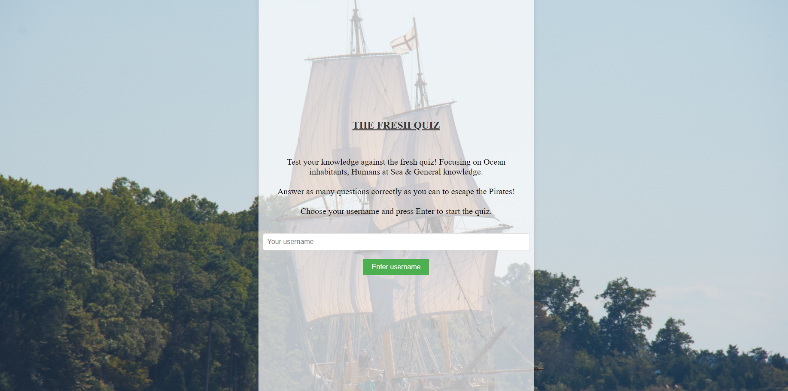

## *Description*

This quiz will cover an ocean themed set of questions. This will test your knowledge on ocean inhabitants, Human interactions with the sea & Ocean general knowledge. All questions are multiple choice, and at the end of the quiz you will be given your score. You are required to enter a username at the beginning of the quiz so we can log your score and display your result at the end. The overall theme of the quiz is based on the ocean and pirates, hence the instruction to outrun the pirates!

The site can be accessed by this [link](https://dmaggsy.github.io/The-Fresh-Quiz/)

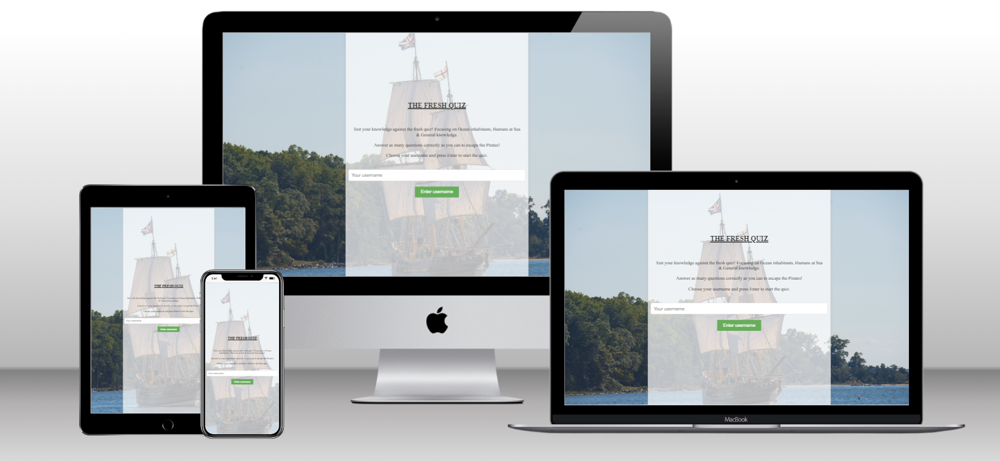

 

## *User Stories* 

### *First Time Visitor Goals*

- As a first time visitor, I want to be able to easily navigate throughout the site to find content.
- As a first time visitor, I want to be able to easily understand the quiz and how to play.

### *Returning Visitor Goals*

- As a returning visitor, I want to be able to try and beat my previous score.

### *Frequent User Goals*

- As a frequent user, I want to be able to see if there are any new questions added to the quiz.

## *Features*

## *Title & Intro Text*

 - The title and intro text will inform the overall idea of the quiz and how to start.

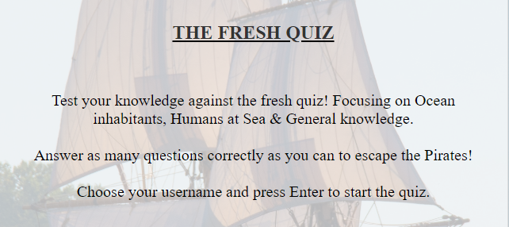

## *Username input & button*

 - The username input and button will allow the user to type and enter their chosen username so they can be identified and their score can be logged.

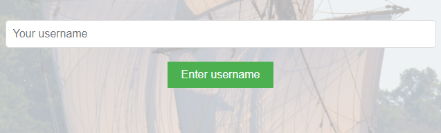

## *Start Quiz Button*

 - The start quiz button will allow the user to start the quiz once they have entered their username. Users will also see a good luck message prior to starting. 

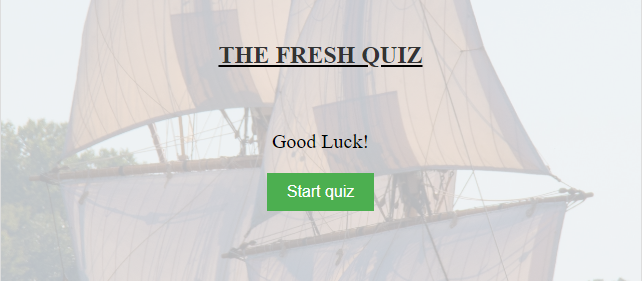

## *Background Image* 

 - The background image features an old fashioned ship to fit in with the theme of the ocean and pirates.

## *Question Screen*

 - The question screen will display the quiz title, the question, the multiple choice options and the submit answer button. The quiz is designed so only one multiple choice option can be selected at a time. However, the user can change their answer as many times as they like before submitting. The Submit button will only be clickable once an option has been selected.

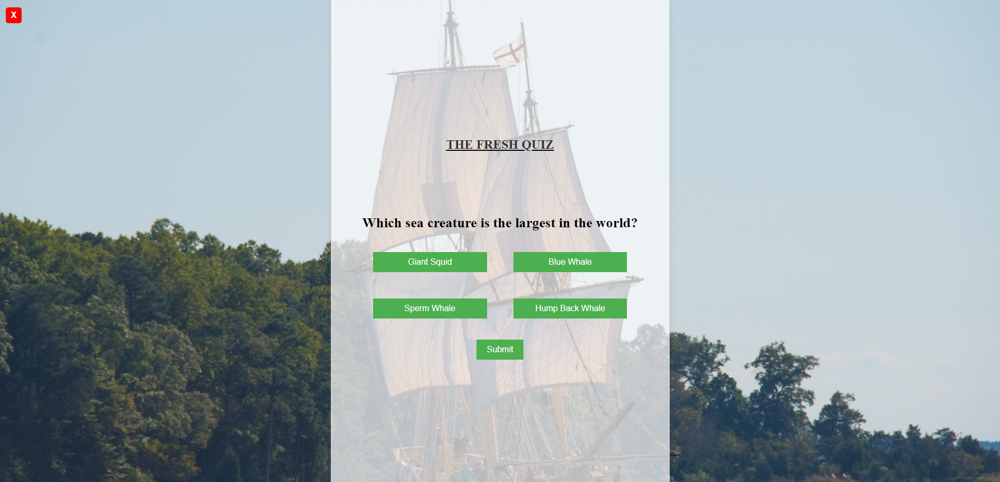

## *Exit Button*

 - Once a user starts the quiz, the Exit quiz button will be visibile throughout. This will allow the user to exit the quiz at any time (this will take them back to the initial username screen). It is also clearly indicated with the conventional red box and white cross (like an old fashioned browser window). 

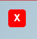

## *Results Screen Outcome*

 - The results screen will display the users score and a message based on their score. The user will also be able to see their username and exit button to head back to the start screen.

- Varying Results Screen 

  - 0-33.33% Shipwreck Theme 

  - 33.34-66.33% Smallboat Theme

  - 66.34-100% Pirateship Theme 

## *Shipwreck Theme*

 - Users will see this results screen if they score between 0-33.33% (please note the exit button is in the far top left corner as per earlier screenshot). 

 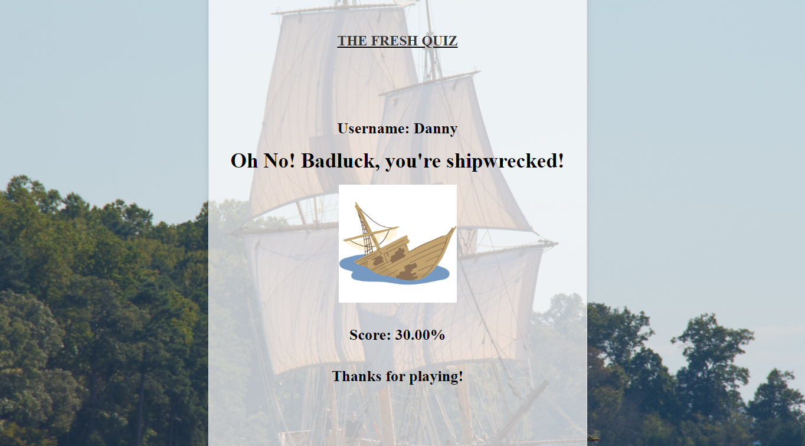

## *Smallboat Theme*

 - Users will see this results screen if they score between 33.34-66.33% (please note the exit button is in the far top left corner as per earlier screenshot).

 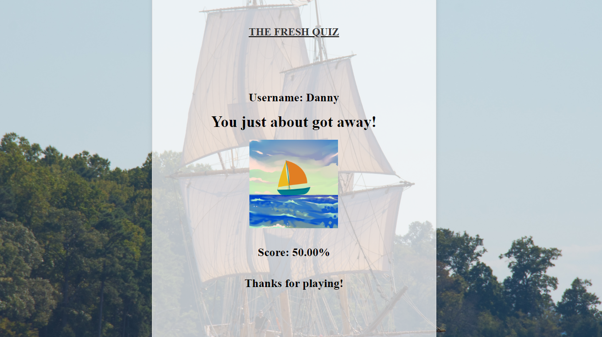

## *Pirateship Theme*

 - Users will see this results screen if they score between 66.34-100% (please note the exit button is in the far top left corner as per earlier screenshot).

 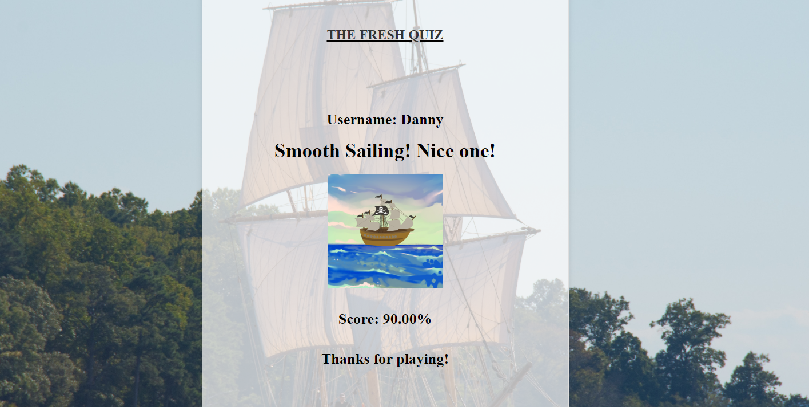

### Languages Used

- [HTML](https://developer.mozilla.org/en-US/docs/Web/HTML) was used as the foundation of the site.
- [CSS](https://developer.mozilla.org/en-US/docs/Web/css) was used to add the styles and layout of the site.
- [CSS Flexbox](https://developer.mozilla.org/en-US/docs/Learn/CSS/CSS_layout/Flexbox) was used to arrange items simmetrically on the pages.
- [CSS Grid](https://developer.mozilla.org/en-US/docs/Web/CSS/grid) - was used on the "Home", "What to buy", "Where to buy" pages in order to display multiple options.
- [Balsamiq](https://balsamiq.com/) was used to make wireframes for the website.
- [VSCode](https://code.visualstudio.com/) was used as the main tool to write and edit code.
- [Git](https://git-scm.com/) was used for the version control of the website.
- [GitHub](https://github.com/) was used to host the code of the website.
- [Media Queries](https://developer.mozilla.org/en-US/docs/Web/CSS/Media_Queries) were used to make the website responsive on different screen sizes.

 

## *Design*

### *Colour Scheme ID via Hex Codes*

- The colour scheme for this quiz was designed to make the users interaction as simple as possible. For example, all in game buttons start Green and then change to yellow once selected. This makes it clear to the user which option they have picked. We also have the exit button in a clearly defined red & white box to make it familiar to the user. 

 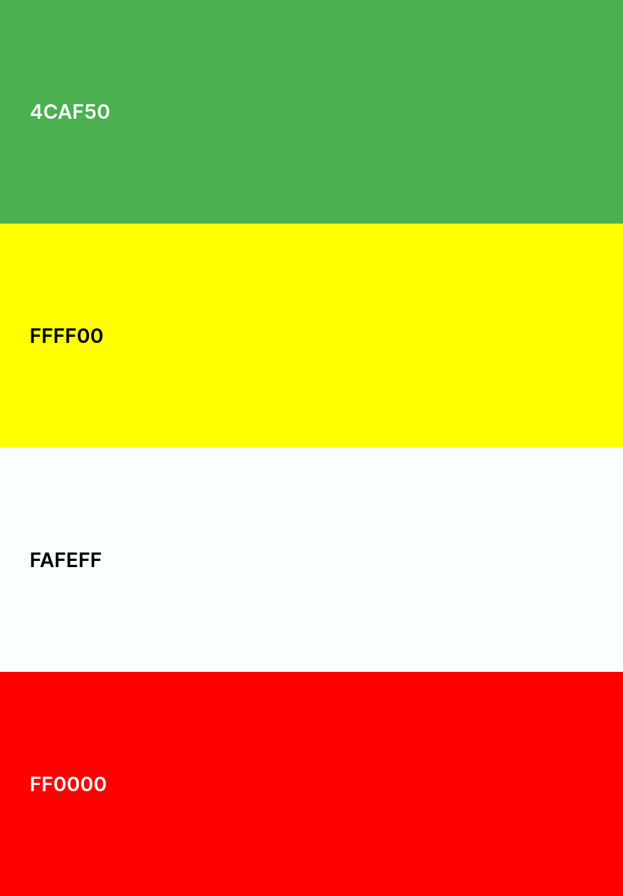

 

## *Typography*

- The font used throughout the quiz is "Roboto sans-serif". This font was chosen as it is easy to read and is a common font used on many websites.

## *Bugs*

 - Solved Bugs

 1. When using the exit button, nothing was happening. We were getting an error in the console: "script.js:87 Uncaught TypeError: Cannot set properties of null (setting 'innerText') at HTMLButtonElement.<anonymous> (script.js:87:48)."

 This script refers to this line within the main Javascript file (under add event listener for "Exit Quiz" button): document.getElementById('score').innerText = 'Score: 0';

 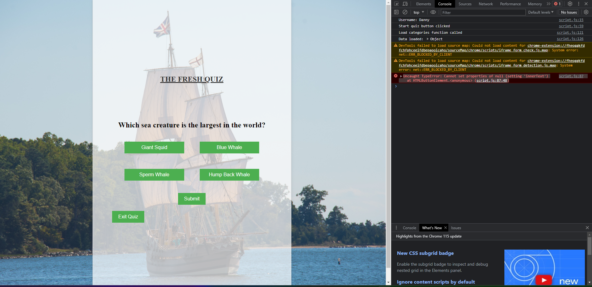

 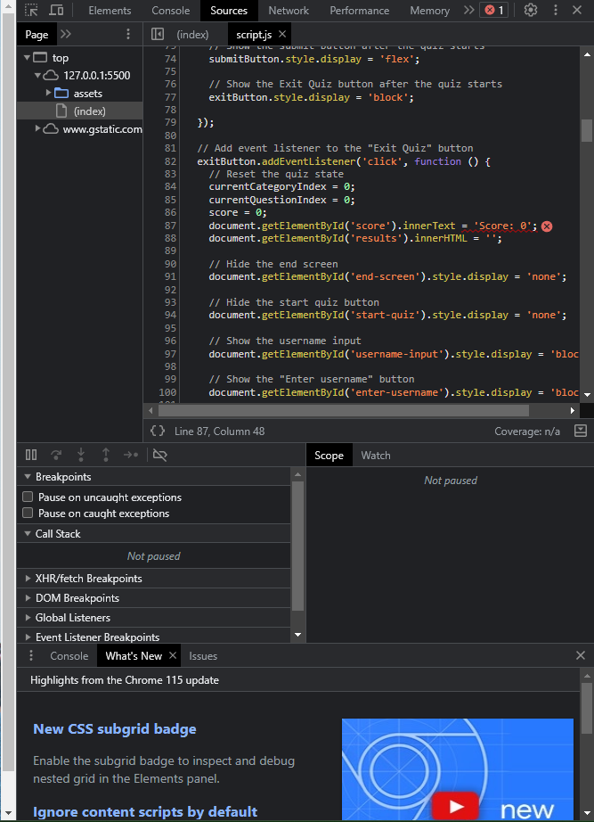

 I solved the issue by removing the above line and adding in the shipwreck, smallboat & pirateship scores to reset respectively. 

document.getElementById('shipwreck-score').innerText = 'Score: 0';
document.getElementById('smallboat-score').innerText = 'Score: 0';
document.getElementById('pirateship-score').innerText = 'Score: 0';

2. Users were able to click the enter username button, without having actually entered a username. Meaning it could be left blank. 

We needed it to work so users had to enter a username before proceeding. If they try just clicking the Enter username button without having 
typed in a username, we need to show an error message staing "Please enter a username in order to proceed."

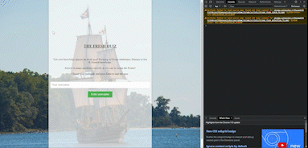

I fixed this by implementing an if statement to check if the username input is blank. If it is, then the error message will be displayed. If it is not blank, then the quiz will start as normal. As you can see from the GIF above, the quiz was allowing the user to proceed without entering a username. 

Code: Fixed by:     // Check if the username input value is empty
    if (username === '') {
    // If the username input value is empty, display an error message and exit the function
    alert('Please enter a username in order to proceed.');
    return;
  }

## *Manual Testing*

| feature | action | expected result | tested | passed | comments |
| --- | --- | --- | --- | --- | --- |
| Username Data Field | Click on field | User can start typing username | Yes | Yes | |
| Username Data Field | Type in username | Username is displayed in field | Yes | Yes | |
| Enter Username Button | Click on Enter Username button | Quiz accepts username | Yes | Yes | |
| Enter Username Button | Click on Enter Username button | Quiz does not accept blank username | Yes | Yes | |
| Start Quiz Button | Click on Start Quiz button | Quiz starts | Yes | Yes | |
| Multiple Choice Answers | Click on answer | Answer changes colour | Yes | Yes | |
| Submit Answer Button | Click on Submit Answer button | Answer is submitted | Yes | Yes | |
| Submit Answer Button | Click on Submit Answer button without selected an answer | Quiz does not accept blank answer | Yes | Yes | |
| Exit Quiz Button | Click on Exit Quiz button | Quiz exits | Yes | Yes | |
| Shipwreck Theme | Score between 0-33.33% | Shipwreck theme is displayed | Yes | Yes | |
| Smallboat Theme | Score between 33.34-66.33% | Smallboat theme is displayed | Yes | Yes | |
| Pirateship Theme | Score between 66.34-100% | Pirateship theme is displayed | Yes | Yes | | 

## *Testing*

- In order to confirm the correct functionality, responsiveness and user experience of the website, it was tested on the following browsers:

  - Google Chrome

    - 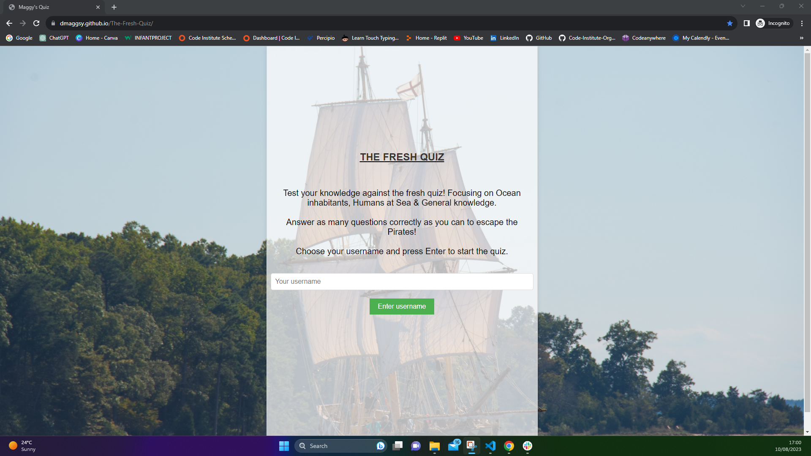
    - 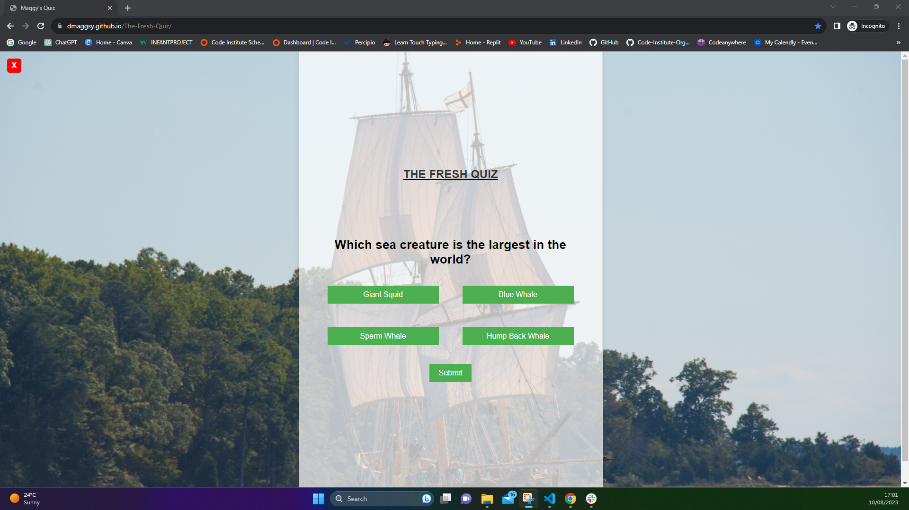
    - 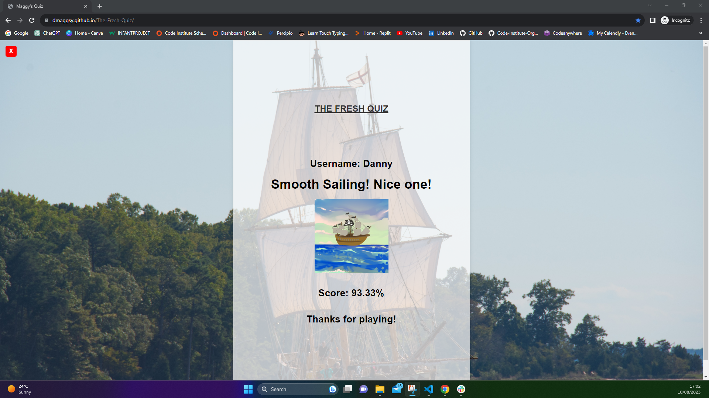
  
  - Microsoft Edge
  
    - 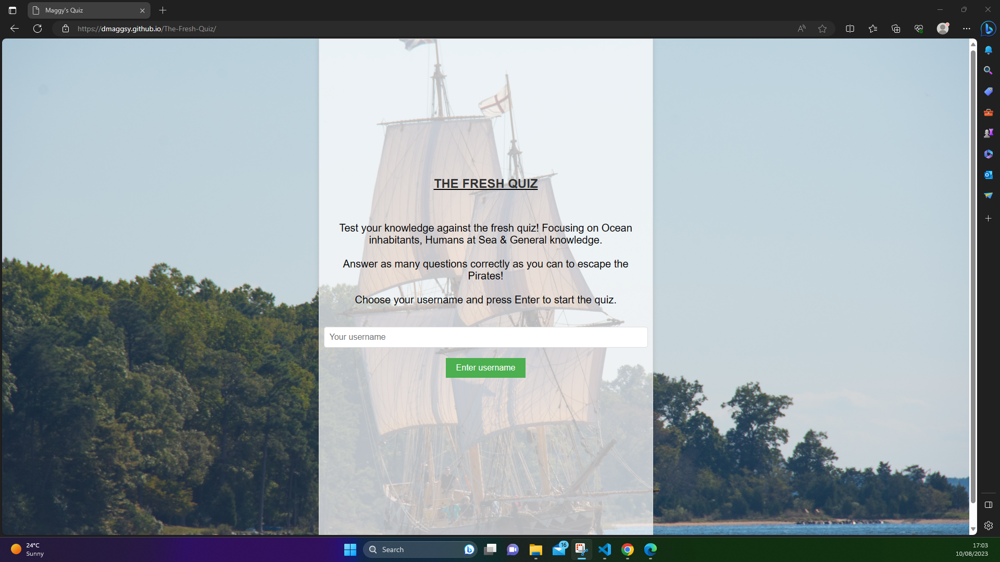
    - 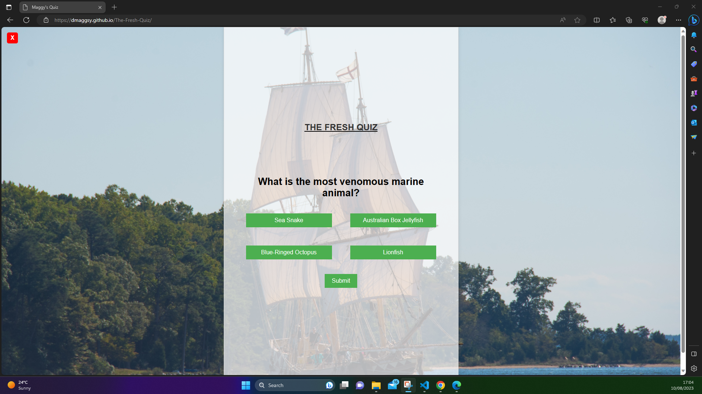
    - 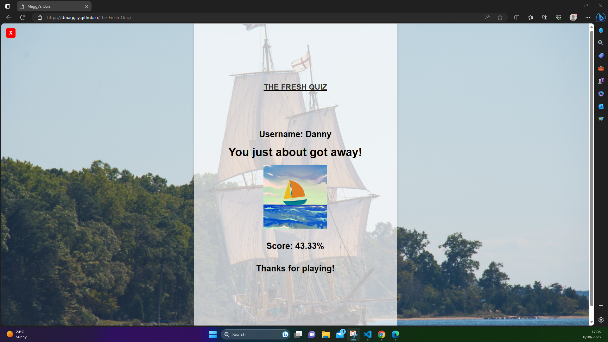
    
  - Mozilla Firefox
   
    - 
    - 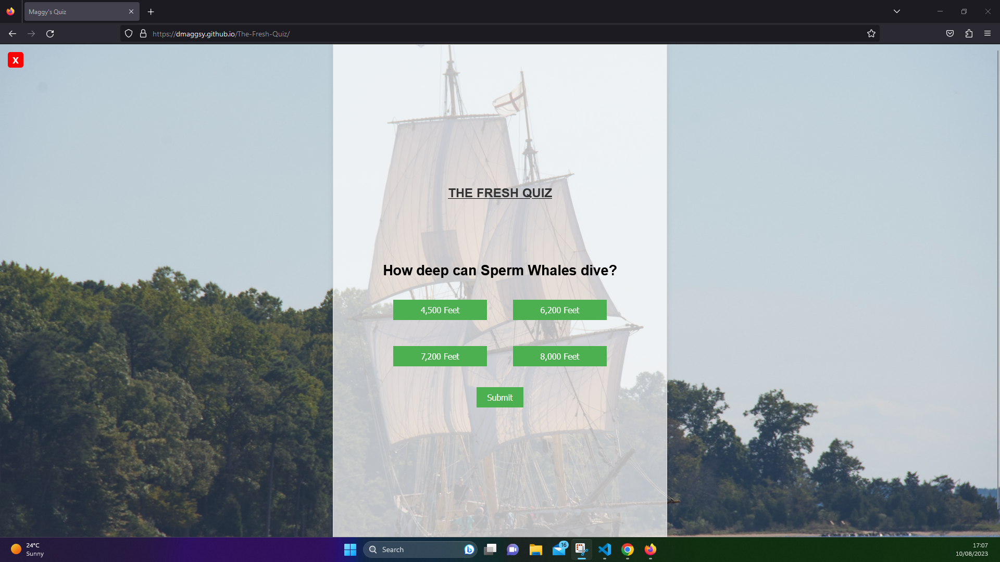
    - 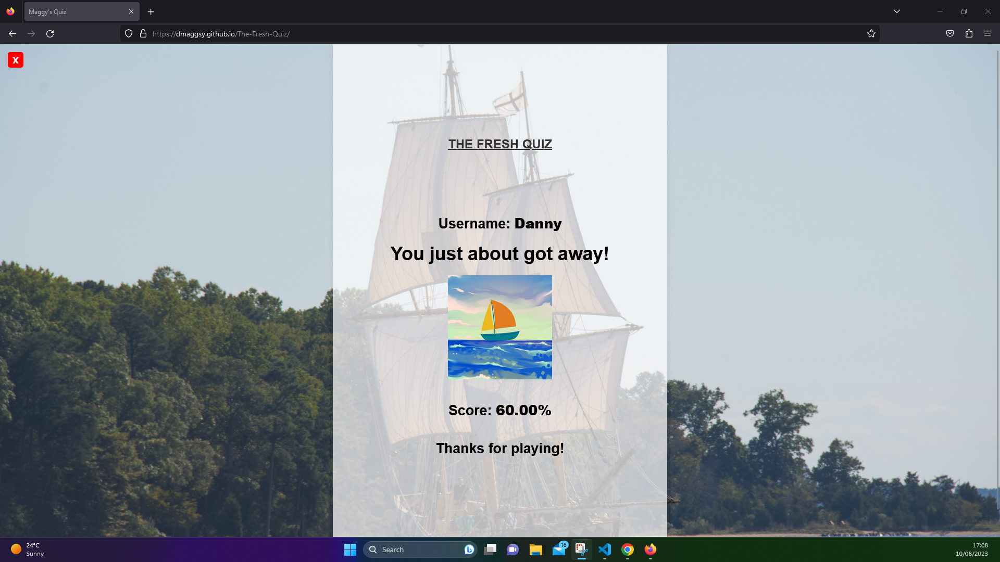

## *Responsiveness*

- The app was tested with [Responsive Website Design Tester](https://responsivedesignchecker.com/).

  - Mobile

    - 320x480

     - [Mobile 1](documentation/320x480_.gif)

    - 320x568

     - [Mobile 2](documentation/320x568_.gif)

    - 375x667

     - [Mobile 3](documentation/375x667_.gif)

    - 414x736

     - [Mobile 4](documentation/414x736_.gif)

  - Tablet 

    - 600x960

     - [Tablet](documentation/600x960_.gif)

    - 768x1024

     - [Tablet](documentation/768x1024_.gif)

    
    
## *Deployment*